# Telos — Test Catalog & Output Tree

> **Auto-generated** from the registries (`src/lib/registry/*.ts`) via `npx tsx scripts/gen-test-tree.ts` — do not hand-edit; regenerate after registry changes.
>
> Purpose: a single reviewable breakdown of every test — **how it is configured** (role slots + options) and **what it outputs** (tables, figures, assumption notes, APA write-up, R map) — for completeness review. **48 of 48 tests run live**; the rest are drawn in the picker but greyed ("arrives in a later slice").

## Flow

## Family → test overview (live tests)

```mermaid
flowchart TD
  T([Telos])
  T --> F1[Descriptive statistics]
  F1 --> F1_0["Summary statistics"]
  F1 --> F1_1["Frequencies & cross-tabs"]
  F1 --> F1_2["Distribution & normality"]
  T --> F2[Group comparisons]
  F2 --> F2_0["One-sample t-test"]
  F2 --> F2_1["Independent t-test"]
  F2 --> F2_2["Paired t-test"]
  F2 --> F2_3["One-way ANOVA + post-hoc"]
  F2 --> F2_4["Factorial ANOVA"]
  F2 --> F2_5["Repeated-measures ANOVA"]
  F2 --> F2_6["Mixed ANOVA"]
  F2 --> F2_7["Nested ANOVA"]
  F2 --> F2_8["Welch's ANOVA"]
  F2 --> F2_9["ANCOVA"]
  F2 --> F2_10["MANOVA"]
  F2 --> F2_11["MANCOVA"]
  F2 --> F2_12["Mann-Whitney U"]
  F2 --> F2_13["Wilcoxon signed-rank"]
  F2 --> F2_14["Kruskal-Wallis"]
  F2 --> F2_15["Friedman"]
  T --> F3[Association]
  F3 --> F3_0["Pearson"]
  F3 --> F3_1["Spearman"]
  F3 --> F3_2["Kendall's tau"]
  F3 --> F3_3["Chi-square independence"]
  F3 --> F3_4["Chi-square goodness-of-fit"]
  F3 --> F3_5["Fisher's exact"]
  T --> F4[Regression & prediction]
  F4 --> F4_0["Simple linear regression"]
  F4 --> F4_1["Multiple linear regression"]
  F4 --> F4_2["Logistic regression"]
  F4 --> F4_3["Poisson / negative binomial"]
  T --> F5[Econometrics]
  F5 --> F5_0["ARIMA / SARIMA"]
  F5 --> F5_1["Stationarity tests (ADF, KPSS)"]
  F5 --> F5_2["Granger causality"]
  F5 --> F5_3["VAR"]
  F5 --> F5_4["Fixed effects"]
  F5 --> F5_5["Random effects"]
  F5 --> F5_6["Hausman test"]
  F5 --> F5_7["Difference-in-differences (DiD)"]
  F5 --> F5_8["Regression discontinuity (RDD)"]
  F5 --> F5_9["Instrumental variables (IV / 2SLS)"]
  F5 --> F5_10["Propensity score matching"]
  T --> F6[Latent variable models]
  F6 --> F6_0["Cronbach's alpha"]
  F6 --> F6_1["Average variance extracted (AVE)"]
  F6 --> F6_2["Composite reliability (CR)"]
  F6 --> F6_3["Exploratory factor analysis (EFA)"]
  F6 --> F6_4["CB-SEM"]
  F6 --> F6_5["PLS-SEM"]
  F6 --> F6_6["Path analysis"]
  T --> F7[Data reduction]
  F7 --> F7_0["Principal component analysis (PCA)"]
```

---

## Detailed tree — configuration & outputs per test

## Descriptive statistics

### Summary statistics
*Descriptive statistics* — central tendency & spread of numeric variables

- **Configure**
  - Roles (drag columns in):
    - **Variables to summarize** — `interval / ratio` · *one or more*
    - **Group by (optional)** — `nominal / ordinal` · *0 or 1*
  - Options:
    - statistics — fixed display: `mean, SD, median, min/max`
    - add — fixed display: `skew / kurtosis`
- **Outputs**
  - **Table — Descriptive statistics**: Variable · N · M · SD · 95% CI · Min · Max · Median · Skew · Kurtosis (excess)
  - *Figure* — Distribution: histogram
  - *Assumption / note* — one row per chosen variable; a Group column is added when "Group by" is used (stats repeat per group). 95% CI is the t-based confidence interval for the mean; kurtosis is excess (normal = 0).
  - *APA template* — "Table {x} reports descriptive statistics for the study variables."
  - *R map* — psych::describe() / dplyr summary → table · ggplot2::geom_histogram() → figure

### Frequencies & cross-tabs
*Descriptive statistics* — counts for categorical data

- **Configure**
  - Roles (drag columns in):
    - **Variable(s)** — `nominal / ordinal` · *1 to 2* — _Drag one category column into Variable(s) for a simple frequency table, or drag a second category column to build a cross-tab that counts the combinations of the two._
  - Options:
    - counts / percentages — fixed display: `counts`
    - cross-tab — fixed display: `when 2 variables`
- **Outputs**
  - **Table 1 — Frequency distribution (one variable)**: Category · n · Valid % · Total % · Cumulative %
  - **Table 2 — Cross-tabulation (two variables · n, row %, col %)**: Row \ Column · Col 1 · Col 2 · … · Total
  - *Figure* — Category counts: bar
  - *Assumption / note* — cross-tab columns expand to the number of categories in the column variable; each cell shows the count plus row and column percentages.
  - *APA template* — "Frequencies (and cross-tabulations) are reported in Table X."
  - *R map* — janitor::tabyl() (+ adorn_* for cross-tab %, cumsum() for cumulative %) → tables · ggplot2::geom_bar() → figure

### Distribution & normality
*Descriptive statistics* — is a variable normally distributed?

- **Configure**
  - Roles (drag columns in):
    - **Variable(s)** — `interval / ratio` · *one or more*
  - Options:
    - normality tests — fixed display: `Shapiro-Wilk + K–S`
    - bins — fixed display: `auto`
- **Outputs**
  - **Table — Normality tests**: Variable · Test · Statistic · N · p · Skew · Kurtosis (excess)
  - *Figure* — Distribution shape: histogram (2 exported panels: histogram, qq)
  - *Assumption / note* — Kurtosis is excess (normal = 0); both via psych::describe (type 3). Shapiro-Wilk applies for 3–5000 cases.
  - *APA template* — "Normality was assessed with the Shapiro-Wilk test, W = {w}, p {p}."
  - *R map* — shapiro.test() (returns W, p) / nortest::lillie.test() (returns D, p) / psych::describe() (skew, excess kurtosis) → table · ggplot2 + stat_qq() → figures

## Group comparisons

### One-sample t-test
*Group comparisons › Parametric* — does a mean differ from a fixed value?

- **Configure**
  - Roles (drag columns in):
    - **Outcome** — `interval / ratio` · *exactly 1*
  - Options:
    - test value (μ₀) — number input (default 0)
    - α — number input (default 0.05)
    - tails — select: two-tailed / one-tailed (greater) / one-tailed (less) (default two-tailed)
    - CI — select: 90% / 95% / 99% (default 95%)
- **Outputs**
  - **Table 1 — Descriptives**: Variable · N · M · SD · SE
  - **Table 2 — One-sample t-test**: Test value · t · df · p · M_diff · 95% CI · Cohen's d [95% CI]
  - *Figure* — Value vs. test value: distribution
  - *Assumption / note* — assumption check: normality (Shapiro-Wilk) reported under the descriptives.
  - *APA template* — "A one-sample t-test gave M={m} vs. {mu0}, t({df})={t}, p {p}, d={d} [{dlo}, {dhi}]."
  - *R map* — t.test(x, mu=) → Table 2 · effectsize::cohens_d() → d · ggplot2 → figure

### Independent t-test
*Group comparisons › Parametric* — do two groups' means differ?

- **Configure**
  - Roles (drag columns in):
    - **Outcome (DV)** — `interval / ratio` · *exactly 1*
    - **Grouping variable** — `nominal / ordinal` · *exactly 1 · 2 categories*
  - Options:
    - α — number input (default 0.05)
    - tails — select: two-tailed / one-tailed (greater) / one-tailed (less) (default two-tailed)
    - equal variance — toggle (default off)
    - CI — select: 90% / 95% / 99% (default 95%)
- **Outputs**
  - **Table 1 — Group statistics**: Group · N · Mean · Std. Dev. · SE
  - **Table 2 — Independent-samples t-test**: Contrast · t · df · p · M_diff · 95% CI · Cohen's d [95% CI]
  - *Figure* — Distribution of the outcome by group: boxplot
  - *Assumption / note* — assumption checks: Levene's test for equal variances & within-group normality (Shapiro-Wilk per group); a Welch row replaces the pooled row when equal-variance is off.
  - *APA template* — "An independent-samples t-test compared {g1} (M={m1}, SD={sd1}) and {g2} (M={m2}, SD={sd2}), t({df})={t}, p {p}, d={d} [{dlo}, {dhi}]."
  - *R map* — t.test() → Table 2 · summary → Table 1 · effectsize::cohens_d() → d · car::leveneTest() → assumption · geom_boxplot() → figure

### Paired t-test
*Group comparisons › Parametric* — do two related measurements differ?

- **Configure**
  - Roles (drag columns in):
    - **Condition A** — `interval / ratio` · *exactly 1*
    - **Condition B** — `interval / ratio` · *exactly 1*
  - Options:
    - α — number input (default 0.05)
    - tails — select: two-tailed / one-tailed (greater) / one-tailed (less) (default two-tailed)
    - CI — select: 90% / 95% / 99% (default 95%)
- **Outputs**
  - **Table 1 — Paired descriptives**: Condition · N · M · SD
  - **Table 2 — Paired-samples t-test**: Pair · t · df · p · M_diff · 95% CI · d [95% CI]_z
  - *Figure* — Change per case: difference
  - *Assumption / note* — assumption check: normality of the difference scores.
  - *APA template* — "A paired-samples t-test gave M={mdiff}, t({df})={t}, p {p}, dz={dz} [{dlo}, {dhi}]."
  - *R map* — dplyr::summarise() / psych::describe() → Table 1 (per-condition N/M/SD) · t.test(paired=TRUE) → Table 2 · effectsize::cohens_d(paired=TRUE) → dz · ggplot2 → figure

### One-way ANOVA + post-hoc
*Group comparisons › Parametric* — do 3+ groups differ, and which pairs?

- **Configure**
  - Roles (drag columns in):
    - **Outcome (DV)** — `interval / ratio` · *exactly 1* — _e.g. the numeric result you measured — test score, income_
    - **Factor (grouping)** — `nominal / ordinal` · *exactly 1 · 3+ categories* — _e.g. label splitting cases into groups — teaching method_
  - Options:
    - α — number input (default 0.05)
    - post-hoc — select: Tukey HSD / Bonferroni / Scheffé (default Tukey HSD)
    - CI — select: 90% / 95% / 99% (default 95%)
- **Outputs**
  - **Table 1 — Descriptives by group**: Group · N · Mean · Std. Dev.
  - **Table 2 — ANOVA**: Source · SS · df · MS · F · p · η² [95% CI]
  - **Table 3 — Post-hoc comparisons**: Pair · M_diff · SE · p_adj · 95% CI
  - *Figure* — Group means: means plot with 95% CI error bars
  - *Assumption / note* — assumption checks: Levene's (equal variances) & normality of residuals.
  - *APA template* — "A one-way ANOVA gave F({df1},{df2})={f}, p {p}, η²={eta2} [{eta2lo}, {eta2hi}]. {posthoc} post-hoc tests showed…"
  - *R map* — aov() → Table 2 · emmeans pairwise contrasts (Mdiff, SE, padj, CI) → Table 3 · effectsize::eta_squared() · ggplot2 → means plot

### Factorial ANOVA
*Group comparisons › Parametric* — main effects + interaction of 2+ factors

- **Configure**
  - Roles (drag columns in):
    - **Outcome (DV)** — `interval / ratio` · *exactly 1* — _e.g. the numeric result you measured — test score, income_
    - **Factors** — `nominal / ordinal` · *two or more* — _e.g. grouping labels — method, gender_
  - Options:
    - α — number input (default 0.05)
    - interactions — toggle (default on)
    - post-hoc — fixed display: `Tukey`
    - CI — select: 90% / 95% / 99% (default 95%)
- **Outputs**
  - **Table 1 — Cell descriptives**: Factor A × B · N · Mean · Std. Dev.
  - **Table 2 — ANOVA (main effects + interaction)**: Source · SS · df · MS · F · p · partial η² [95% CI]
  - **Table 3 — Simple effects / post-hoc**: Contrast · M_diff · SE · p_adj · 95% CI
  - *Figure* — Interaction: interaction plot (one line per level of a factor)
  - *Assumption / note* — assumption checks: Levene's & normality of residuals; post-hoc / simple-effects table when an effect is significant.
  - *APA template* — "A two-way ANOVA gave A×B interaction F({df1},{df2})={f}, p {p}, partial η²={pes} [{lo}, {hi}]."
  - *R map* — aov() / afex::aov_car() → Table 2 · emmeans → Table 3 · ggplot2 → interaction plot

### Repeated-measures ANOVA
*Group comparisons › Parametric* — 3+ conditions on the same subjects

- **Configure**
  - Roles (drag columns in):
    - **Subject ID** — `any level` · *exactly 1* — _e.g. the column identifying each person — participant_id_
    - **Repeated measures** — `interval / ratio` · *2 or more* — _e.g. same measure each time — score_t1, score_t2, score_t3_
  - Options:
    - α — number input (default 0.05)
    - sphericity — select: GG correction / HF correction / none (default GG correction)
    - post-hoc — toggle (default on)
- **Outputs**
  - **Table 1 — Condition descriptives**: Condition · N · M · SD
  - **Table 2 — Repeated-measures ANOVA**: Source · SS · df · MS · F · p · partial η² [95% CI]
  - **Table 3 — Sphericity (Mauchly's test)**: Effect · W · p · GG ε · HF ε
  - **Table 4 — Post-hoc comparisons**: Pair · M_diff · SE · p_adj · 95% CI
  - *Figure* — Means across conditions: profile plot (means ± CI across conditions)
  - *Assumption / note* — when sphericity is violated the F-test uses the Greenhouse–Geisser / Huynh–Feldt correction; post-hoc table follows. Mauchly's test & the GG/HF corrections apply only when the repeated factor has 3+ levels (with 2 levels sphericity is automatically met and this table is omitted).
  - *APA template* — "A repeated-measures ANOVA ({correction}) gave F({df1},{df2})={f}, p {p}, partial η²={pes} [{pes_lo}, {pes_hi}]."
  - *R map* — dplyr::group_by()+summarise() → Table 1 (per-condition N/M/SD) · afex::aov_ez() → Tables 2–3 · emmeans → Table 4 (post-hoc) · ggplot2 → profile plot

### Mixed ANOVA
*Group comparisons › Parametric* — between-groups × repeated conditions

- **Configure**
  - Roles (drag columns in):
    - **Subject ID** — `any level` · *exactly 1* — _e.g. the column identifying each person — participant_id_
    - **Between-groups factor** — `nominal / ordinal` · *exactly 1* — _e.g. the column splitting people into groups — treatment vs control_
    - **Repeated measures** — `interval / ratio` · *2 or more* — _e.g. same measure each time — score_t1, score_t2, score_t3_
  - Options:
    - α — number input (default 0.05)
    - sphericity — select: GG correction / HF correction / none (default GG correction)
    - post-hoc — toggle (default on)
- **Outputs**
  - **Table 1 — Descriptives by group × condition**: Group · Condition · N · M · SD
  - **Table 2 — Mixed ANOVA**: Source · SS · df · MS · F · p · partial η² [95% CI]
  - **Table 3 — Sphericity (Mauchly's test)**: Effect · W · p · GG ε · HF ε
  - **Table 4 — Post-hoc comparisons (condition pairs)**: Pair · M_diff · SE · p_adj · 95% CI
  - *Figure* — Means across conditions by group: profile plot (one line per group, means ± CI across conditions)
  - *Assumption / note* — assumption check: Levene's (equal variances between groups). between and within effects are tested against different error terms; when sphericity is violated the within and interaction F-tests use the Greenhouse–Geisser / Huynh–Feldt correction. Mauchly's test & the GG/HF corrections apply only when the repeated factor has 3+ levels (with 2 levels sphericity is automatically met and this table is omitted).
  - *APA template* — "A mixed ANOVA yielded a {between_name} × {within_name} interaction, F({df1},{df2})={f}, p {p}, partial η²={pes} [{lo}, {hi}]."
  - *R map* — dplyr::group_by()+summarise() → Table 1 (group × condition N/M/SD) · afex::aov_ez() → Tables 2–3 · emmeans → Table 4 (post-hoc) · ggplot2 → profile plot

### Nested ANOVA
*Group comparisons › Parametric* — one factor nested within another

- **Configure**
  - Roles (drag columns in):
    - **Outcome (DV)** — `interval / ratio` · *exactly 1* — _e.g. the numeric result you measured — test score, income_
    - **Factor** — `nominal / ordinal` · *exactly 1* — _e.g. a grouping label — teaching method_
    - **Nested factor** — `nominal / ordinal` · *exactly 1 · within Factor* — _e.g. a sub-group inside the factor — classroom within school_
  - Options:
    - α — number input (default 0.05)
    - nesting — select: random / fixed (default random)
- **Outputs**
  - **Table 1 — Descriptives by top-level group**: Group · N · Mean · Std. Dev.
  - **Table 2 — Nested ANOVA**: Source · SS · df · MS · F · p · ω² [95% CI]
  - *Figure* — Grouped means: grouped means plot (nested groups within each top-level group)
  - *Assumption / note* — Under random nesting the F for the upper factor (A) uses the nested factor's mean square B(A) as its error term, while B(A) is tested against the residual — so the two F rows do not share the same denominator. Variance components (or ω²) are reported as the effect size where estimable. Assumption checks: Levene's (equal variances across top-level groups) & normality of residuals (Shapiro-Wilk).
  - *APA template* — "A nested ANOVA for A gave F({df1},{df2})={f}, p {p}, ω²={o2} [{lo}, {hi}]."
  - *R map* — aov(y ~ A + Error(A:B)) (random) / aov(y ~ A/B) (fixed) → table · effectsize::omega_squared() → effect size · ggplot2 → figure

### Welch's ANOVA
*Group comparisons › Parametric* — 3+ groups, unequal variances

- **Configure**
  - Roles (drag columns in):
    - **Outcome (DV)** — `interval / ratio` · *exactly 1* — _e.g. the numeric result you measured — test score, income_
    - **Factor** — `nominal / ordinal` · *exactly 1 · 3+ categories* — _e.g. a grouping label — teaching method_
  - Options:
    - α — number input (default 0.05)
    - post-hoc — fixed display: `Games-Howell`
- **Outputs**
  - **Table 1 — Descriptives by group**: Group · N · Mean · Std. Dev.
  - **Table 2 — Welch's ANOVA**: F · df1 · df2 · p
  - **Table 3 — Games-Howell post-hoc**: Pair · M_diff · p_adj · 95% CI
  - *Figure* — Group means: means plot with 95% CI error bars
  - *Assumption / note* — Welch's adjusts the degrees of freedom so equal variances are not assumed (df2 is fractional); within-group normality is still assumed and checked with Shapiro-Wilk per group.
  - *APA template* — "Welch's ANOVA gave F({df1},{df2})={f}, p {p}."
  - *R map* — oneway.test(var.equal=FALSE) → Table 2 · rstatix::games_howell_test() → Table 3

### ANCOVA
*Group comparisons › Parametric* — group means adjusted for a covariate

- **Configure**
  - Roles (drag columns in):
    - **Outcome (DV)** — `interval / ratio` · *exactly 1* — _e.g. the numeric result you measured — test score, income_
    - **Factor** — `nominal / ordinal` · *one or more* — _e.g. a grouping label — teaching method_
    - **Covariate(s)** — `interval / ratio` · *one or more* — _e.g. numeric control(s) to hold constant — baseline score, age_
  - Options:
    - α — number input (default 0.05)
    - post-hoc — fixed display: `adjusted means`
    - CI — select: 90% / 95% / 99% (default 95%)
- **Outputs**
  - **Table 1 — Adjusted (estimated marginal) means**: Group · Adj. M · SE · 95% CI
  - **Table 2 — ANCOVA**: Source · SS · df · MS · F · p · partial η² [95% CI]
  - **Table 3 — Post-hoc comparisons (adjusted means)**: Pair · M_diff  (adj.) · SE · p_adj · 95% CI
  - *Figure* — Adjusted means: adjusted means plot (covariate-controlled, ± CI)
  - *Assumption / note* — assumption checks: homogeneity of regression slopes (factor×covariate interaction) & Levene's; post-hoc on adjusted means.
  - *APA template* — "Controlling for the covariate, an ANCOVA gave F({df1},{df2})={f}, p {p}, partial η²={pes} [{plo}, {phi}]."
  - *R map* — car::Anova(type=3) → Table 2 (SS/df/F/p) · effectsize::eta_squared(partial=TRUE) → partial η² · emmeans → adjusted means & Table 3 (post-hoc) · ggplot2 → figure

### MANOVA
*Group comparisons › Parametric* — groups compared on several outcomes at once

- **Configure**
  - Roles (drag columns in):
    - **Outcomes (DVs)** — `interval / ratio` · *two or more* — _e.g. two or more numeric outcomes — score, satisfaction_
    - **Factor(s)** — `nominal / ordinal` · *one or more* — _e.g. grouping labels — method, gender_
  - Options:
    - α — number input (default 0.05)
    - test statistic — select: Pillai / Wilks (default Pillai)
    - follow-up ANOVAs — toggle (default on)
- **Outputs**
  - **Table 1 — Multivariate tests**: Effect · Pillai / Wilks · approx F · df1 · df2 · p
  - **Table 2 — Follow-up univariate ANOVAs (per DV)**: DV · F · df1 · df2 · p · partial η² [95% CI]
  - *Figure* — Group means per outcome: means plot faceted by DV
  - *Assumption / note* — assumption check: homogeneity of covariance matrices (Box's M).
  - *APA template* — "A MANOVA gave Pillai's V={v}, F({df1},{df2})={f}, p {p}."
  - *R map* — manova() + summary(.., test="Pillai") → Table 1 · summary.aov() → Table 2 (F/df/p) · effectsize::eta_squared(partial=TRUE) → partial η²

### MANCOVA
*Group comparisons › Parametric* — MANOVA with covariate control

- **Configure**
  - Roles (drag columns in):
    - **Outcomes (DVs)** — `interval / ratio` · *two or more* — _e.g. two or more numeric outcomes — score, satisfaction_
    - **Factor(s)** — `nominal / ordinal` · *one or more* — _e.g. grouping labels — method, gender_
    - **Covariate(s)** — `interval / ratio` · *one or more* — _e.g. numeric control(s) to hold constant — baseline score, age_
  - Options:
    - α — number input (default 0.05)
    - test statistic — select: Pillai / Wilks (default Pillai)
- **Outputs**
  - **Table 1 — Multivariate tests (covariate-adjusted)**: Effect · Pillai / Wilks · approx F · df1 · df2 · p
  - **Table 2 — Adjusted univariate follow-ups**: DV · F · df1 · df2 · p · partial η² [95% CI]
  - *Figure* — Adjusted means per outcome: adjusted means plot faceted by DV
  - *Assumption / note* — assumption checks include homogeneity of covariance matrices (Box's M) and homogeneity of regression slopes for each covariate.
  - *APA template* — "A MANCOVA gave a covariate-adjusted group effect, Pillai's V={v}, F({df1},{df2})={f}, p {p}."
  - *R map* — manova() + summary(.., test=) (covariates first — matches car::Manova) → Table 1 · summary.aov() → Table 2 (F/df/p) · effectsize::eta_squared(partial=TRUE) → partial η² · emmeans → adjusted means

### Mann-Whitney U
*Group comparisons › Nonparametric* — nonparametric two-group comparison

- **Configure**
  - Roles (drag columns in):
    - **Outcome** — `ordinal / interval / ratio` · *exactly 1*
    - **Grouping var** — `nominal / ordinal` · *exactly 1 · 2 categories*
  - Options:
    - α — number input (default 0.05)
    - tails — select: two-tailed / one-tailed (greater) / one-tailed (less) (default two-tailed)
    - continuity correction — toggle (default on)
- **Outputs**
  - **Table 1 — Rank summary**: Group · N · Mean rank · Median · IQR · Sum of ranks
  - **Table 2 — Mann-Whitney test**: U · Z · p · r [95% CI]
  - *Figure* — Distribution by group: boxplot
  - *Assumption / note* — r is the rank-biserial effect size. The Hodges-Lehmann estimate is the median of all between-group score differences (a location shift); its CI is from the same wilcox.test.
  - *APA template* — "A Mann-Whitney U test gave U={u}, Z={z}, p {p}, r={r} [{rlo}, {rhi}]."
  - *R map* — dplyr rank + group_by/summarise (N, mean rank, median, IQR, sum of ranks) → Table 1 · wilcox.test() → U, p · wilcox.test(conf.int=TRUE) → Hodges-Lehmann median difference + 95% CI · coin::wilcox_test() → standardized Z · effectsize::rank_biserial() → r · geom_boxplot() → figure

### Wilcoxon signed-rank
*Group comparisons › Nonparametric* — nonparametric paired comparison

- **Configure**
  - Roles (drag columns in):
    - **Condition A** — `ordinal / interval / ratio` · *exactly 1*
    - **Condition B** — `ordinal / interval / ratio` · *exactly 1*
  - Options:
    - α — number input (default 0.05)
    - tails — select: two-tailed / one-tailed (greater) / one-tailed (less) (default two-tailed)
    - continuity correction — toggle (default on)
- **Outputs**
  - **Table 1 — Rank summary**: Sign · N · Mean rank · Sum of ranks
  - **Table 2 — Signed-rank test**: V / W · Z · p · r [95% CI] · Median diff [95% CI]
  - *Figure* — Change per case: difference
  - *APA template* — "A Wilcoxon signed-rank test gave V={v}, Z={z}, p {p}, r={r} [{rlo}, {rhi}]."
  - *R map* — rank(abs(d)) split by sign(d) → Table 1 (per-sign N / mean rank / sum of ranks) · wilcox.test(paired=TRUE, conf.int=TRUE) → V, p, Hodges–Lehmann median difference + 95% CI · coin::wilcoxsign_test() → standardized Z · effectsize::rank_biserial(paired=TRUE) → r

### Kruskal-Wallis
*Group comparisons › Nonparametric* — nonparametric 3+ group comparison

- **Configure**
  - Roles (drag columns in):
    - **Outcome** — `ordinal / interval / ratio` · *exactly 1* — _e.g. the numeric result you measured — test score, income_
    - **Grouping var** — `nominal / ordinal` · *exactly 1 · 3+ categories* — _e.g. label splitting cases into 3+ groups — teaching method_
  - Options:
    - α — number input (default 0.05)
    - post-hoc — fixed display: `Dunn's test`
- **Outputs**
  - **Table 1 — Rank summary**: Group · N · Median · IQR · Mean rank
  - **Table 2 — Kruskal-Wallis test**: H · df · p · ε² [95% CI]
  - **Table 3 — Dunn post-hoc**: Pair · Z · p_adj
  - *Figure* — Distribution by group: boxplot
  - *APA template* — "A Kruskal-Wallis test gave H({df})={h}, p {p}, ε²={eps2} [{eps2lo}, {eps2hi}]."
  - *R map* — kruskal.test() → H, df, p · rstatix::kruskal_effsize() / effectsize::rank_epsilon_squared() → ε² · dunn.test/FSA::dunnTest() → Table 3

### Friedman
*Group comparisons › Nonparametric* — nonparametric repeated measures

- **Configure**
  - Roles (drag columns in):
    - **Subject ID** — `any level` · *exactly 1* — _e.g. the column identifying each person — participant_id_
    - **Repeated measures** — `ordinal / interval / ratio` · *2 or more* — _e.g. same measure each time — score_t1, score_t2, score_t3_
  - Options:
    - α — number input (default 0.05)
    - post-hoc — fixed display: `Nemenyi`
- **Outputs**
  - **Table 1 — Rank summary**: Condition · Mean rank
  - **Table 2 — Friedman test**: χ² · df · p · Kendall's W [95% CI]
  - **Table 3 — Post-hoc (Nemenyi)**: Pair · p_adj
  - *Figure* — Across conditions: profile / box plot
  - *APA template* — "A Friedman test gave χ²({df})={chi2}, p={p}, W={w} [{wlo}, {whi}]."
  - *R map* — colMeans(apply(data, 1, rank)) → Table 1 (per-condition mean rank) · friedman.test() → χ², df, p · rstatix::friedman_effsize() / effectsize::kendalls_w() → Kendall's W · PMCMRplus (Nemenyi) → Table 3

## Association

### Pearson correlation
*Association › Correlation* — linear association of two numeric variables

- **Configure**
  - Roles (drag columns in):
    - **Variable A** — `interval / ratio` · *exactly 1*
    - **Variable B** — `interval / ratio` · *exactly 1*
  - Options:
    - α — number input (default 0.05)
    - tails — select: two-tailed / one-tailed (greater) / one-tailed (less) (default two-tailed)
    - CI — select: 90% / 95% / 99% (default 95%)
- **Outputs**
  - **Table — Pearson correlation**: Pair · r · 95% CI · t · df · p · N
  - *Figure* — Relationship: scatter plot with fitted line
  - *APA template* — "[X] and [Y] were correlated, r({df})={r}, p {p}, 95% CI [{ciLow}, {ciHigh}]."
  - *R map* — cor.test() → table · geom_point()+geom_smooth(method="lm") → figure

### Spearman correlation
*Association › Correlation* — rank association (ordinal / monotonic)

- **Configure**
  - Roles (drag columns in):
    - **Variable A** — `ordinal / interval / ratio` · *exactly 1*
    - **Variable B** — `ordinal / interval / ratio` · *exactly 1*
  - Options:
    - α — number input (default 0.05)
    - tails — select: two-tailed / one-tailed (greater) / one-tailed (less) (default two-tailed)
- **Outputs**
  - **Table — Spearman correlation**: Pair · ρ [95% CI] · S · p · N
  - *Figure* — Relationship: scatter plot (optionally on ranks)
  - *Assumption / note* — ρ CI from a seeded percentile bootstrap (2000 resamples); cor.test does not return one for rank correlation.
  - *APA template* — "A Spearman correlation gave ρ={rho} [{lo}, {hi}], p {p}, N={n}."
  - *R map* — cor.test(method="spearman") → table · ggplot2 → figure

### Kendall's tau
*Association › Correlation* — rank association, robust to ties

- **Configure**
  - Roles (drag columns in):
    - **Variable A** — `ordinal / interval / ratio` · *exactly 1*
    - **Variable B** — `ordinal / interval / ratio` · *exactly 1*
  - Options:
    - α — number input (default 0.05)
    - tails — select: two-tailed / one-tailed (greater) / one-tailed (less) (default two-tailed)
- **Outputs**
  - **Table — Kendall's tau**: Pair · τ_b  [95% CI] · z · p · N
  - *Figure* — Relationship: scatter plot (optionally on ranks — τ measures monotonic, not linear, association)
  - *Assumption / note* — τ is Kendall’s tau-b — the tie-corrected variant (cor.test, method = "kendall").
  - *APA template* — "A Kendall's tau-b correlation gave τ={tau} [{lo}, {hi}], p {p}, N={n}."
  - *R map* — cor.test(method="kendall") → table · ggplot2 → figure

### Chi-square independence
*Association › Categorical* — are two categorical variables related?

- **Configure**
  - Roles (drag columns in):
    - **Row variable** — `nominal / ordinal` · *exactly 1*
    - **Column variable** — `nominal / ordinal` · *exactly 1*
  - Options:
    - α — number input (default 0.05)
    - continuity correction — toggle (default on)
- **Outputs**
  - **Table 1 — Contingency (observed [expected] (row% / col%) std. residual)**: Row \ Column · Col 1 · Col 2 · … · Total
  - **Table 2 — Chi-square test**: χ² · df · p · Cramér's V [95% CI]
  - *Figure* — Cross-classification: mosaic or grouped bar chart
  - *Assumption / note* — the contingency table is r×c — columns expand to the number of categories in the column variable; each cell shows observed [expected] (row% / col%) and its standardized residual r (chisq.test()$stdres), with a warning (suggesting Fisher's exact) if expected counts are too small. A standardized residual beyond about ±1.96 flags a cell that significantly drives the association. For 2×2 tables chisq.test() applies Yates' continuity correction to the χ² by default (set correct=FALSE for the uncorrected χ²); the standardized residuals are unaffected by the correction.
  - *APA template* — "A chi-square test of independence gave χ²({df}, N={n})={chisq}, p {p}, V={v} [{vlo}, {vhi}]."
  - *R map* — chisq.test() → Table 2 · chisq.test(...)$stdres → Table 1 std. residuals · sqrt(χ²/(N·min(r−1,c−1))) (matches rcompanion::cramerV) → V · ggplot2::geom_bar() → figure

### Chi-square goodness-of-fit
*Association › Categorical* — do counts match an expected split?

- **Configure**
  - Roles (drag columns in):
    - **Variable** — `nominal / ordinal` · *exactly 1*
  - Options:
    - expected proportions — equal vs. custom per-category proportions (must sum to 1)
    - α — number input (default 0.05)
- **Outputs**
  - **Table 1 — Observed vs. expected**: Category · Observed · Expected · Std. residual
  - **Table 2 — Goodness-of-fit test**: χ² · df (k−1) · p · Cohen's w [95% CI]
  - *Figure* — Observed vs. expected: bar chart (observed vs. expected)
  - *Assumption / note* — here df = number of categories − 1 (not (r−1)(c−1) as in the independence test).
  - *APA template* — "A goodness-of-fit test, χ²({df}, N={n})={chisq}, p {p}, w={w} [{lo}, {hi}]."
  - *R map* — chisq.test(x, p=) → Table 2 · chisq.test(...)$stdres → Table 1 std. residuals · effectsize::cohens_w() → w · chisq.test(..., simulate.p.value=TRUE) for sparse data · ggplot2 → figure

### Fisher's exact
*Association › Categorical* — exact test for small categorical tables

- **Configure**
  - Roles (drag columns in):
    - **Row variable** — `nominal / ordinal` · *exactly 1*
    - **Column variable** — `nominal / ordinal` · *exactly 1*
  - Options:
    - α — number input (default 0.05)
    - tails — select: two-tailed / one-tailed (greater) / one-tailed (less) (default two-tailed)
- **Outputs**
  - **Table 1 — Contingency**: Row \ Column · Col 1 · Col 2 · Total
  - **Table 2 — Fisher's exact test**: p (exact) · Odds ratio (cond. MLE) · 95% CI · Cramér's V [95% CI]
  - *Figure* — Cross-classification: mosaic / grouped bar chart
  - *Assumption / note* — the odds ratio is fisher.test()'s conditional MLE (not the sample cross-product) and, with its CI, is reported for 2×2 tables only; for larger tables the OR is undefined, so Cramér's V (effectsize::cramers_v) reports the strength of association alongside the exact p.
  - *APA template* — "A Fisher's exact test of [Var1] by [Var2] gave p {p}."
  - *R map* — fisher.test() → Table 2 · ggplot2::geom_bar() → figure

## Regression & prediction

### Simple linear regression
*Regression & prediction* — one numeric outcome, one predictor

- **Configure**
  - Roles (drag columns in):
    - **Outcome (DV)** — `interval / ratio` · *exactly 1* — _e.g. the numeric result you measured — test score, income_
    - **Predictor** — `any level` · *exactly 1* — _e.g. one explanatory variable — hours studied_
  - Options:
    - α — number input (default 0.05)
    - CI — select: 90% / 95% / 99% (default 95%)
- **Outputs**
  - **Table — Regression coefficients** (coefficients · estimate / (SE) / [CI]): (1) · β — _GOF footer:_ Num.Obs. · R² · R² Adj. · F · RMSE · AIC · BIC · Log.Lik.
  - *Figure* — Fit & residuals: fitted-line scatter + residual diagnostic plots (2 exported panels: fit, residuals)
  - *Assumption / note* — assumption checks: linearity, normality of residuals, homoscedasticity.
  - *APA template* — "A simple linear regression gave B={b}, t({df})={t}, p {p}, R²={r2}."
  - *R map* — lm() → Tables 1–2 · parameters::standardise_parameters() → β · ggplot2 → figures

### Multiple linear regression
*Regression & prediction* — one numeric outcome, several predictors

- **Configure**
  - Roles (drag columns in):
    - **Outcome (DV)** — `interval / ratio` · *exactly 1* — _e.g. the numeric result you measured — test score, income_
    - **Predictors** — `any level` · *one or more* — _e.g. explanatory variables — age, gender, hours studied_
  - Options:
    - α — number input (default 0.05)
    - CI — select: 90% / 95% / 99% (default 95%)
    - standardize — toggle (default off)
- **Outputs**
  - **Table — Regression coefficients** (coefficients · estimate / (SE) / [CI]): (1) · β · VIF — _GOF footer:_ Num.Obs. · R² · R² Adj. · F · RMSE · AIC · BIC · Log.Lik.
  - *Figure* — Residual diagnostics: residual / diagnostic plots
  - *Figure* — Coefficient plot: coefficient plot, standardized β with 95% CI
  - *Assumption / note* — assumption checks: linearity, normality, homoscedasticity, and multicollinearity (VIF).
  - *APA template* — "The model explained R²={r2} of the variance, F({df1},{df2})={f}, p {p}; predictor X gave B={b}, p {p2}."
  - *R map* — lm() → Tables 1–2 · parameters::standardise_parameters() → β · car::vif() → VIF · ggplot2/performance::check_model() → figures

### Logistic regression
*Regression & prediction* — predict a yes/no outcome

- **Configure**
  - Roles (drag columns in):
    - **Outcome (DV)** — `nominal` · *exactly 1 · 2 categories* — _e.g. the yes/no result you measured — passed, churned_
    - **Predictors** — `any level` · *one or more* — _e.g. explanatory variables — age, gender, hours studied_
  - Options:
    - α — number input (default 0.05)
    - CI — select: 90% / 95% / 99% (default 95%)
    - report odds ratios — toggle (default on)
    - event category — select a category of the assigned `outcome` column (default: 2nd level)
- **Outputs**
  - **Table 1 — Coefficients** (coefficients · estimate / (SE) / [CI]): Log-odds (B) · Odds ratio (OR) — _GOF footer:_ Num.Obs. · Nagelkerke R² · Omnibus χ² · Log.Lik. · AIC · BIC
  - **Table 2 — Classification**: Predicted \ Observed · 0 · 1 · % correct
  - *Figure* — Classifier performance: ROC curve (with AUC)
  - *APA template* — "Predictor X was associated with the outcome, OR={or}, 95% CI [{ciLow}, {ciHigh}], p {p} (AUC={auc})."
  - *R map* — glm(family=binomial) → B/SE/z/p · exp(cbind(OR=coef(m), confint(m))) → OR + 95% CI · performance::r2_nagelkerke(m) → Nagelkerke R² · anova(m, test="Chisq") → omnibus χ² · logLik(m)/AIC(m)/BIC(m) → Log.Lik./AIC/BIC · table(predicted, observed) → Table 2 (classification) · pROC → ROC/AUC

### Poisson / negative binomial
*Regression & prediction* — predict a count outcome

- **Configure**
  - Roles (drag columns in):
    - **Outcome (DV)** — `count` · *non-negative integers · exactly 1* — _e.g. a count of events you tallied — complaints, visits_
    - **Predictors** — `any level` · *one or more* — _e.g. explanatory variables — age, gender, hours studied_
    - **Exposure (optional)** — `interval / ratio` · *0 or 1 · offset* — _e.g. observation time / population at risk (log offset)_
  - Options:
    - model — select: Poisson / negative binomial (default Poisson)
    - α — number input (default 0.05)
    - CI — select: 90% / 95% / 99% (default 95%)
    - offset — fixed display: `from Exposure`
- **Outputs**
  - **Table — Coefficients** (coefficients · estimate / (SE) / [CI]): Log-count (B) · IRR — _GOF footer:_ Num.Obs. · Dispersion · Residual deviance · df · Log.Lik. · AIC · BIC
  - *Figure* — Fit / residuals: fitted vs. residual plot
  - *Assumption / note* — dispersion check (Poisson): if variance >> mean (over-dispersion), switch to negative binomial, which instead reports theta (its overdispersion parameter) rather than this ratio.
  - *APA template* — "Predictor X was associated with the count, IRR={irr}, 95% CI [{ciLow}, {ciHigh}], p {p}."
  - *R map* — glm(family=poisson, offset=log(exposure)) / MASS::glm.nb() → B/SE/z/p · exp(cbind(IRR=coef(m), confint(m))) → IRR + 95% CI · performance::check_overdispersion() → dispersion

## Econometrics

### ARIMA / SARIMA
*Econometrics › Time series* — model & forecast one series

- **Configure**
  - Roles (drag columns in):
    - **Time variable** — `datetime / ordered` · *exactly 1* — _e.g. the date / time-order column — month, year_
    - **Series (value)** — `interval / ratio` · *exactly 1* — _e.g. the numeric value over time — monthly sales_
  - Options:
    - order — arima-order
    - seasonal period — number input (default 12)
    - forecast horizon — number input (default 12)
- **Outputs**
  - **Table 1 — Model summary** (coefficients · estimate / (SE) / [CI]): (1) — _GOF footer:_ Num.Obs. · σ² · Ljung–Box p · AIC · BIC · Log.Lik.
  - **Table 2 — Forecast**: Period · Forecast · 80% PI · 95% PI
  - *Figure* — Forecast: forecast plot (history + forecast with prediction intervals)
  - *Figure* — Residual diagnostics: residual ACF + Normal Q–Q
  - *Assumption / note* — arima()/auto.arima() return each coefficient with its SE (CI via confint()); they do not produce per-coefficient z/p — add lmtest::coeftest() if those are wanted. The Ljung–Box row tests residual autocorrelation jointly to lag = max(10, 2 × seasonal period), with df adjusted for the number of fitted ARMA terms (p + q + P + Q).
  - *APA template* — "An ARIMA({pdq})({PDQ}) model was fit (AIC={aic}); the Ljung–Box test of residual autocorrelation gave p {ljungbox_p}."
  - *R map* — forecast::auto.arima() / arima() → Tables · forecast() + autoplot() → figure

### Stationarity tests (ADF, KPSS)
*Econometrics › Time series* — is the series stationary?

- **Configure**
  - Roles (drag columns in):
    - **Time** — `datetime / ordered` · *exactly 1* — _e.g. the date / time-order column — month, year_
    - **Series** — `interval / ratio` · *exactly 1* — _e.g. numeric series over time — sales, visitors_
  - Options:
    - test — select: both · ADF + KPSS / ADF only / KPSS only (default true)
    - lags — select: auto (default auto)
    - α — number input (default 0.05)
- **Outputs**
  - **Table — Stationarity tests**: Test · Statistic · Lag · p · Conclusion
  - *Figure* — Series & structure: series plot + ACF / PACF (and differenced series) (2 exported panels: series, acf)
  - *Assumption / note* — ADF and KPSS have opposite null hypotheses — the conclusion column reconciles them. The Statistic column holds two different metrics (ADF: Dickey–Fuller τ; KPSS: LM statistic); KPSS p-values are interpolated and shown bounded (e.g. “> .10” / “< .01”) rather than exact.
  - *APA template* — "ADF gave τ={adf}, p {adfp}; KPSS gave LM={kpss}, p {kpssp}; Phillips–Perron gave Z={pp}, p {ppp} (α={alpha})."
  - *R map* — tseries::adf.test() / tseries::kpss.test() → table · forecast::ggAcf() → figures

### Granger causality
*Econometrics › Time series* — does X predict future Y?

- **Configure**
  - Roles (drag columns in):
    - **Time** — `datetime / ordered` · *exactly 1* — _e.g. the date / time-order column — month, year_
    - **Series X** — `interval / ratio` · *exactly 1* — _e.g. the predictor series — ad spend over time_
    - **Series Y** — `interval / ratio` · *exactly 1* — _e.g. the outcome series — sales over time_
  - Options:
    - max lag — number input (default 4)
    - α — number input (default 0.05)
- **Outputs**
  - **Table — Granger tests (both directions)**: Direction · F · df · p
  - *Figure* — Series together: cross-series time plot
  - *Assumption / note* — tests predictive precedence, not true causation; both series should be stationary first. Tests use a max lag of 4; select the lag on theory or by AIC/BIC (vars::VARselect) and report it.
  - *APA template* — "Granger test X→Y: F({df1xy},{df2xy})={fxy}, p {pxy}; Y→X: F({df1yx},{df2yx})={fyx}, p {pyx} (lag={lag})."
  - *R map* — lmtest::grangertest() run once per direction (or vars::causality()) → the two table rows · ggplot2 → figure

### VAR
*Econometrics › Time series* — several interrelated series

- **Configure**
  - Roles (drag columns in):
    - **Time** — `datetime / ordered` · *exactly 1* — _e.g. the date / time-order column — month, year_
    - **Series** — `interval / ratio` · *two or more* — _e.g. numeric series over time — sales, visitors_
  - Options:
    - lag order — select: auto (default auto)
    - IRF horizon — number input (default 10)
- **Outputs**
  - **Table 1 — Lag selection**: Lag · AIC · BIC · HQ
  - **Table 2 — VAR coefficients (per equation)** (coefficients · estimate / (SE) / [CI]): Series 1 — _GOF footer:_ Num.Obs. · R² · R² Adj. · RMSE · Log.Lik.
  - **Table 3 — Forecast-error variance decomposition**: Variable · Impulse · Share
  - *Figure* — Dynamic response: impulse-response function plots
  - *Assumption / note* — one column per equation (response series); each cell stacks the estimate, its (SE), and the [95% CI] — the per-coefficient t/p are dropped. orthogonalised (Cholesky) IRFs depend on the ordering of the series; a level VAR assumes stationarity. stability check: max companion-eigenvalue modulus < 1 indicates a stable VAR. serial-correlation check: the Portmanteau test (vars::serial.test, asymptotic) tests the null of no residual autocorrelation — a small p suggests remaining serial correlation (consider a higher lag order).
  - *APA template* — "A VAR({p}) model was selected by AIC; impulse-response functions are shown (Figure)."
  - *R map* — vars::VARselect() → Table 1 · vars::VAR() → Table 2 · vars::irf() → figure

### Fixed effects
*Econometrics › Panel data* — panel regression, entity effects

- **Configure**
  - Roles (drag columns in):
    - **Entity** — `nominal / ordinal` · *exactly 1* — _e.g. the unit observed repeatedly — firm, country, student_
    - **Time** — `datetime / ordered` · *exactly 1* — _e.g. the date / time-order column — month, year_
    - **Outcome (DV)** — `interval / ratio` · *exactly 1* — _e.g. the numeric result you measured — test score, income_
    - **Regressors** — `any level` · *one or more* — _e.g. explanatory variables — R&D spend, leverage_
  - Options:
    - effects — select: entity / time / two-way (default entity)
    - std. errors — select: clustered by entity / classical (default clustered by entity)
    - α — number input (default 0.05)
- **Outputs**
  - **Table — Coefficients (within estimator)** (coefficients · estimate / (SE) / [CI]): (1) — _GOF footer:_ Num.Obs. · N entities · Within R² · Adj. within R² · F-test
  - *Figure* — Coefficients: coefficient plot (estimate ± CI)
  - *Assumption / note* — time-invariant predictors are absorbed by the entity effects and drop out; a predictor must also change within entities over time to be estimable — predictors with little within-entity variation give large standard errors and unreliable estimates.
  - *APA template* — "In a fixed-effects model, predictor X gave B={b}, p {p} (clustered SE)."
  - *R map* — plm(model="within") / fixest::feols() → Table · ggplot2 → figure

### Random effects
*Econometrics › Panel data* — panel regression, random entity effects

- **Configure**
  - Roles (drag columns in):
    - **Entity** — `nominal / ordinal` · *exactly 1* — _e.g. the unit observed repeatedly — firm, country, student_
    - **Time** — `datetime / ordered` · *exactly 1* — _e.g. the date / time-order column — month, year_
    - **Outcome (DV)** — `interval / ratio` · *exactly 1* — _e.g. the numeric result you measured — test score, income_
    - **Regressors** — `any level` · *one or more* — _e.g. explanatory variables — R&D spend, leverage_
  - Options:
    - α — number input (default 0.05)
    - std. errors — select: clustered by entity / classical (default clustered by entity)
- **Outputs**
  - **Table — Coefficients** (coefficients · estimate / (SE) / [CI]): (1) — _GOF footer:_ Num.Obs. · N entities · R² · R² Adj.
  - *Figure* — Coefficients: coefficient plot
  - *Assumption / note* — standard errors are clustered by entity. unlike fixed effects, time-invariant predictors can be retained. summary(plm) returns a single R² / adj. R² (not a within/between/overall split).
  - *APA template* — "In a random-effects model, predictor X gave B={b}, p {p}."
  - *R map* — plm(model="random") → Table · ggplot2 → figure

### Hausman test
*Econometrics › Panel data* — fixed vs. random effects?

- **Configure**
  - Roles (drag columns in):
    - **Entity** — `nominal / ordinal` · *exactly 1* — _e.g. the unit observed repeatedly — firm, country, student_
    - **Time** — `datetime / ordered` · *exactly 1* — _e.g. the date / time-order column — month, year_
    - **Outcome (DV)** — `interval / ratio` · *exactly 1* — _e.g. the numeric result you measured — test score, income_
    - **Regressors** — `any level` · *one or more* — _e.g. explanatory variables — R&D spend, leverage_
  - Options:
    - α — number input (default 0.05)
- **Outputs**
  - **Table — Hausman test** (coefficients · estimate / (SE) / [CI]): Fixed effects · Random effects · Difference — _GOF footer:_ Num.Obs. · N entities · R²
  - *Figure* — FE vs. RE: side-by-side coefficient plot
  - *APA template* — "A Hausman test comparing the fixed- and random-effects estimates gave χ²({df})={chisq}, p {p}."
  - *R map* — plm::phtest() + compare within / random fits → Table · ggplot2 → figure

### Difference-in-differences (DiD)
*Econometrics › Causal inference* — policy effect, before/after × treated/control

- **Configure**
  - Roles (drag columns in):
    - **Outcome (DV)** — `interval / ratio` · *exactly 1* — _e.g. the numeric result you measured — test score, income_
    - **Treatment group** — `binary nominal` · *exactly 1* — _e.g. who got the treatment — treated = 1 / 0_
    - **Period (pre / post)** — `binary nominal` · *exactly 1* — _e.g. before vs after — post = 1 / 0_
    - **Entity / cluster unit (for clustered SEs)** — `nominal / ordinal` · *exactly 1* — _e.g. the unit observed repeatedly — state, firm_
    - **Time (for parallel-trends plot)** — `datetime / ordered` · *exactly 1* — _e.g. the date / time-order column — month, year_
  - Options:
    - α — number input (default 0.05)
    - std. errors — select: clustered / classical (default clustered)
    - covariates — fixed display: `none`
- **Outputs**
  - **Table — DiD model** (coefficients · estimate / (SE) / [CI]): (1) — _GOF footer:_ Num.Obs. · N entities · Within R² · F
  - *Figure* — Parallel trends: parallel-trends plot (group means over time, treatment marked)
  - *Assumption / note* — the Treated×Post interaction is the DiD effect; valid only if pre-treatment trends are parallel. Under entity fixed effects the time-invariant Treated main effect is absorbed (only Post and Treated×Post are estimated).
  - *APA template* — "The DiD estimate was B={b}, 95% CI [{lo}, {hi}], p {p} (clustered SE)."
  - *R map* — plm(model="within") with clustered SE → table · ggplot2 → trends plot

### Regression discontinuity (RDD)
*Econometrics › Causal inference* — effect at a cutoff

- **Configure**
  - Roles (drag columns in):
    - **Outcome (DV)** — `interval / ratio` · *exactly 1* — _e.g. the numeric result you measured — test score, income_
    - **Running variable** — `interval / ratio` · *exactly 1* — _e.g. the score that decides the cutoff — exam mark_
  - Options:
    - cutoff value — number input (default 50)
    - bandwidth — fixed display: `auto`
    - polynomial order — select: 1 · linear / 2 · quadratic (default 1 · linear)
- **Outputs**
  - **Table — RD estimate** (coefficients · estimate / (SE) / [CI]): (1) — _GOF footer:_ Bandwidth · N (left) · N (right)
  - *Figure* — Discontinuity: RD plot (binned scatter + fitted lines either side of the cutoff)
  - *Assumption / note* — inference is robust (bias-corrected): the SE / CI use rdrobust robust standard errors. Bandwidth selector: MSE-optimal (mserd); kernel: triangular.
  - *APA template* — "At the cutoff, the treatment effect was {b}, 95% CI [{lo}, {hi}], p {p}."
  - *R map* — rdrobust::rdrobust() → table · rdrobust::rdplot() → figure

### Instrumental variables (IV / 2SLS)
*Econometrics › Causal inference* — effect with an endogenous predictor

- **Configure**
  - Roles (drag columns in):
    - **Outcome (DV)** — `interval / ratio` · *exactly 1* — _e.g. the numeric result you measured — test score, income_
    - **Endogenous regressor** — `any level` · *one or more* — _e.g. the predictor you suspect is biased — years of schooling_
    - **Instrument(s)** — `any level` · *one or more* — _e.g. shifts the predictor but not the outcome directly — distance to school_
    - **Controls (optional)** — `any level` · *zero or more* — _e.g. other variables to hold constant — age, region_
  - Options:
    - α — number input (default 0.05)
    - std. errors — select: robust / classical (default robust)
    - weak-instrument test — fixed display: `on`
- **Outputs**
  - **Table 1 — First stage (instrument strength)**: Instrument · Coef. · SE · Partial F · p
  - **Table 2 — 2SLS coefficients** (coefficients · estimate / (SE) / [CI]): OLS · 2SLS — _GOF footer:_ Num.Obs. · RMSE · F
  - *Figure* — Coefficients: coefficient plot (OLS vs. 2SLS)
  - *Assumption / note* — diagnostics: weak-instrument (first-stage F), Wu-Hausman endogeneity, and Sargan over-identification (when applicable).
  - *APA template* — "The 2SLS estimate for X was B={b}, p {p} (first-stage F={f})."
  - *R map* — lm(endog ~ instruments + covariates) → Table 1 (first-stage coef./SE/partial F) · summary(AER::ivreg(...), diagnostics=TRUE) → Table 2 (2SLS) + weak-IV F, Wu-Hausman, Sargan

### Propensity score matching
*Econometrics › Causal inference* — treatment effect via matching

- **Configure**
  - Roles (drag columns in):
    - **Outcome (DV)** — `interval / ratio` · *exactly 1* — _e.g. the numeric result you measured — test score, income_
    - **Treatment** — `binary nominal` · *exactly 1 · 2 categories* — _e.g. who got the treatment — treated = 1 / 0_
    - **Covariates** — `any level` · *one or more* — _e.g. variables to match / control on — age, baseline score_
  - Options:
    - matching method — fixed display: `nearest`
    - caliper — number input (default 0)
    - ratio — select: 1:1 / 2:1 / 3:1 (default 1:1)
- **Outputs**
  - **Table 1 — Covariate balance (before / after)**: Covariate · Std. mean diff (pre) · Std. mean diff (post) · Variance ratio
  - **Table 2 — Treatment effect (ATT)** (coefficients · estimate / (SE) / [CI]): (1) — _GOF footer:_ Num.Obs. · Treated (matched) · Control (matched)
  - *Figure* — Balance: love plot (standardized differences before vs. after matching)
  - *Assumption / note* — good matching drives post-matching standardized mean differences toward 0 (commonly < 0.1). The common-support rows report how many treated units fell off the region of common support (dropped) and the propensity-score overlap range by group — wide non-overlap weakens the comparison.
  - *APA template* — "After propensity-score matching, the ATT was {b}, 95% CI [{lo}, {hi}], p {p}."
  - *R map* — MatchIt::matchit() → balance + matched data · lm()/marginaleffects on matched data → ATT · cobalt::love.plot()

## Latent variable models

### Cronbach's alpha
*Latent variable models › Reliability* — internal consistency of one scale

- **Configure**
  - Roles (drag columns in):
    - **Items** — `ordinal / interval` · *3 or more · one construct*
  - Options:
    - standardized alpha — toggle (default off)
    - drop-item statistics — toggle (default on)
- **Outputs**
  - **Table 1 — Reliability**: ω · α · 95% CI · N items · N cases
  - **Table 2 — Item-total statistics**: Item · Corrected item-total r · α if item dropped
  - *Figure* — Item contribution: item-total correlation bar chart
  - *APA template* — "Internal consistency was high, ω={omega} (95% CI [{ciLow}, {ciHigh}]); Cronbach's α={alpha}."
  - *R map* — psych::alpha() → α + item-total · lavaan::cfa() + semTools::compRelSEM() → ω + 95% CI · ggplot2 → figure

### Average variance extracted (AVE)
*Latent variable models › Reliability* — convergent and discriminant validity

- **Configure**
  - Roles (drag columns in):
  - Options:
    - estimator — fixed display: `ML (continuous) · WLSMV (ordinal)`
- **Outputs**
  - **Table 1 — Convergent validity**: Construct · AVE · CR · ω · α
  - **Table 2 — Discriminant validity (Fornell–Larcker)**: 
  - **Table 3 — Discriminant validity (HTMT)**: 
  - *Figure* — Validity overview: AVE / CR bar chart per construct
  - *Assumption / note* — AVE ≥ .50 indicates adequate convergent validity; computed from the CFA loadings (Fornell & Larcker, 1981). CR ≥ .70 acceptable (Nunnally, 1978; Bagozzi & Yi, 1988); do not cite CR ≥ .70 to Fornell & Larcker. ω (McDonald's) is the preferred reliability coefficient — model-based, not assuming tau-equivalence (McNeish, 2018); α is retained as a secondary/legacy column. Fornell–Larcker: diagonal = √AVE (bold); off-diagonal = inter-construct latent correlations. HTMT < .85 indicates discriminant validity for conceptually distinct constructs (Henseler, Ringle & Sarstedt, 2015). When only 1 construct is defined, Tables 2 and 3 are suppressed (discriminant validity requires ≥ 2 constructs). Applies to reflective constructs only.
  - *APA template* — "Convergent validity was supported, all AVE ≥ .50 and CR ≥ .70; discriminant validity held, all HTMT < .85."
  - *R map* — lavaan::cfa() → fit · semTools::AVE() → AVE · semTools::compRelSEM() → CR / ω · psych::alpha() → α · lavInspect(fit,"cor.lv") + sqrt(AVE) on diagonal → Table 2 (Fornell–Larcker) · semTools::htmt() → Table 3 (HTMT) · ggplot2 → figure

### Composite reliability (CR)
*Latent variable models › Reliability* — construct reliability

- **Configure**
  - Roles (drag columns in):
  - Options:
    - estimator — fixed display: `ML (continuous) · WLSMV (ordinal)`
- **Outputs**
  - **Table — Composite reliability**: Construct · CR · AVE · ω · α
  - *Figure* — Reliability overview: CR bar chart per construct
  - *Assumption / note* — CR ≥ .70 indicates adequate reliability (Nunnally, 1978; Bagozzi & Yi, 1988); do not cite CR ≥ .70 to Fornell & Larcker. CR and ω (McDonald's) coincide for a congeneric (unidimensional) model — both columns are computed from semTools::compRelSEM(); AVE is from semTools::AVE(); α (Cronbach's) is retained as a secondary/legacy column (psych::alpha()). Applies to reflective constructs only.
  - *APA template* — "Composite reliability was satisfactory (CR = .__ ≥ .70)."
  - *R map* — lavaan::cfa() → fit · semTools::compRelSEM() → CR / ω · semTools::AVE() → AVE · psych::alpha() → α · ggplot2 → figure

### Exploratory factor analysis (EFA)
*Latent variable models › Factor analysis* — discover underlying factors

- **Configure**
  - Roles (drag columns in):
    - **Items** — `ordinal / interval / ratio` · *3 or more*
  - Options:
    - retention — select: parallel / Kaiser / fixed-n (default parallel)
    - n factors — number input (default 2)
    - rotation — select: oblimin / varimax (default oblimin)
    - extraction — select: PAF / ML (default PAF)
- **Outputs**
  - **Table 1 — Suitability**: KMO · Bartlett's χ² · df · p
  - **Table 2 — Variance explained**: Factor · Eigenvalue · % variance · Cumulative %
  - **Table 3 — Rotated factor loadings**: Item · Factor 1 · Factor 2 · Communality
  - **Table 4 — Interfactor correlations (Φ)**: 
  - *Figure* — Factor retention: scree plot (with parallel analysis)
  - *Assumption / note* — Loading columns expand to the number of retained factors; loadings |< .32| suppressed (Tabachnick & Fidell). Φ (interfactor correlations) shown for oblique rotation (oblimin) only — omitted for varimax (orthogonal). KMO ≥ .60 acceptable, ≥ .70 preferred (Kaiser & Rice, 1974). Bartlett p < .001 required. Parallel analysis (Horn, 1965) is the preferred retention rule; Kaiser eigenvalue > 1 is offered but systematically over-extracts (Zwick & Velicer, 1986). Factor order: descending SS-loadings.
  - *APA template* — "EFA (KMO = __, Bartlett's χ²(__) = __, p < .001) with parallel analysis retained __ factors explaining __% of variance (__ rotation)."
  - *R map* — psych::KMO()/cortest.bartlett() → Table 1 · R_PARALLEL_ANALYSIS → retention · psych::fa() → Tables 2–3 · fa()$Phi → Table 4 (oblimin only) · ggplot2 → scree figure

### CB-SEM
*Latent variable models › Structural equation modeling* — confirmatory structural model

- **Configure**
  - Roles (drag columns in):
  - Options:
    - estimator — fixed display: `WLSMV (ordinal) / ML / MLR`
    - missing — fixed display: `MI`
    - bootstrap — fixed display: `5000`
- **Outputs**
  - **Table 1 — EFA suitability**: KMO · Bartlett's χ² · df · p
  - **Table 2 — EFA rotated factor loadings**: Item · Factor 1 · Factor 2 · Communality
  - **Table 3 — Measurement model (CFA loadings)**: Construct → Item · B · SE · z · p · Std. loading
  - **Table 4 — Reliability & validity**: Construct · CR · AVE · ω · α
  - **Table 5 — Fit indices**: χ² (df, p) · χ²/df · CFI · TLI · RMSEA [90% CI] · SRMR
  - **Table 6 — Structural paths**: Path · B · SE · z · p · Std. β · 95% CI · R²
  - **Table 7 — Indirect effects (mediation)**: Path · Estimate · SE · boot 95% CI · p
  - *Figure* — Model: path diagram (constructs, loadings, structural paths)
  - *Assumption / note* — Tables shown follow the pipeline stages you ran (EFA → CFA → fit → structural); if EFA was deselected, Tables 1–2 are omitted; if the structural stage was deselected, Tables 6–7 are omitted. Good-fit guidelines (Hu & Bentler, 1999; Marsh, Hau & Wen, 2004): CFI/TLI ≥ .95, RMSEA ≤ .06 [90% CI], SRMR ≤ .08 — guidelines, not pass/fail gates; RMSEA is unstable at small df / small N, so interpret it cautiously for compact models. Use WLSMV for ordinal indicators. R² is filled once per endogenous (outcome) construct. When the model is saturated (df = 0, e.g. a just-identified path model), the fit-indices table is suppressed and a saturation flag is shown. EFA on the same sample is exploratory — treat it as a diagnostic, not confirmatory evidence. The indirect-effects table appears only when the drawn structural paths form a chain (X → M → Y); each indirect effect is a lavaan defined effect with a bootstrapped 95% CI. Moderation is planned for a later version.
  - *APA template* — "The model fit well (CFI=__, RMSEA=__, SRMR=__); the path from X to Y gave β=__, p=__."
  - *R map* — (if EFA stage run) psych::KMO()/cortest.bartlett() → Table 1 · psych::fa() → Table 2 · lavaan::sem() (estimator ML/MLR or WLSMV) → loadings & structural paths · lavaan::fitMeasures() (or summary(fit, fit.measures=TRUE)) → Table 5 fit indices (χ²/df = chisq/df) · semTools::compRelSEM() / AVE() / psych::alpha() → CR/AVE/ω/α table · lavInspect(fit, "rsquare") → Table 6 R² · defined effects (:= in the lavaan syntax, se="bootstrap") → Table 7 indirect effects · semPlot::semPaths() → diagram

### PLS-SEM
*Latent variable models › Structural equation modeling* — variance-based structural model

- **Configure**
  - Roles (drag columns in):
  - Options:
    - weighting — fixed display: `path`
    - bootstrap — fixed display: `5000`
    - missing — fixed display: `global step-4a setting`
- **Outputs**
  - **Table 1 — Measurement model (outer loadings / weights)**: Construct → Item · Loading / weight · t · p
  - **Table 2 — Reliability & convergent validity (per construct)**: Construct · α · ρ_A · CR (ρ_C ) · AVE
  - **Table 3 — Discriminant validity — HTMT (construct × construct)**: 
  - **Table 4 — Structural paths**: Path · β · t · p · 95% CI · f²
  - **Table 5 — Structural model quality (per endogenous construct)**: Construct · R² · R²_adj · Q²
  - **Table 6 — Indirect effects (mediation)**: Path · Estimate · SE · boot 95% CI · p
  - *Figure* — Model: path diagram (with loadings, path coefficients, R²)
  - *Assumption / note* — HTMT is a construct-by-construct matrix (not a per-construct value) — columns expand to the number of constructs in the model; HTMT < .85/.90 supports discriminant validity (Henseler, Ringle & Sarstedt, 2015). Significance comes from bootstrapping (percentile 95% CIs, 5000 resamples); R² and Q² assess the structural model (f²: ~0.02 small, 0.15 medium, 0.35 large; Cohen, 1988). PLS-SEM deliberately has no global fit indices (CFI/TLI/RMSEA) — judge it by reliability & validity, then R²/Q²/f² (Hair et al., 2019). The indirect-effects table appears only when the drawn paths form a chain (X → M → Y). Formative constructs suppress AVE/HTMT and are judged by indicator weights, VIF, and redundancy convergent validity. Moderation is planned for a later version.
  - *APA template* — "In the PLS-SEM, the path from X to Y gave β=__, p=__ (bootstrap); R²Y=__."
  - *R map* — seminr → Tables & bootstrap · summary() → R²/R²adj · seminr::predict_pls() → Q² · seminr::specific_effect_significance() (on the bootstrapped model) → Table 6 indirect effects · seminr::plot() → diagram

### Path analysis
*Latent variable models › Structural equation modeling* — directed relationships among observed variables (path / mediation models)

- **Configure**
  - Roles (drag columns in):
  - Options:
    - estimator — fixed display: `ML`
    - bootstrap resamples — fixed display: `5000`
- **Outputs**
  - **Table 1 — Structural paths**: Path · B · SE · z · p · Std. β · 95% CI · R²
  - **Table 2 — Indirect effects**: Path · Estimate · SE · boot 95% CI · p
  - *Figure* — Path diagram: app-drawn path diagram with fitted estimates
  - *Assumption / note* — Path analysis fits directed relationships among observed variables (lavaan::sem) — no latent measurement model, so no CFA loadings, reliability, or AVE are reported. When the model is saturated (df = 0, e.g. a single-mediator X → M → Y chain), it fits the data perfectly by construction and global fit indices (χ², CFI, TLI, RMSEA, SRMR) are not reported; an over-identified model (df > 0) reports fit, interpreting RMSEA cautiously at small df / small N (Kenny, Kaniskan & McCoach, 2015). Indirect (mediated) effects are tested with bias-uncorrected percentile bootstrap 95% CIs (5,000 resamples; MacKinnon, Lockwood & Williams, 2004); an interval excluding 0 indicates a credible indirect effect.
  - *APA template* — "A path model fit to the observed variables; the indirect effect of X on Y through M was significant, bootstrap 95% CI excluding 0."
  - *R map* — lavaan::sem() on observed variables (regressions only; no =~) → fit · standardizedSolution() + lavInspect(fit,"rsquare") → Table 1 (structural paths + R²) · auto := indirect-effect definitions + bootstrap (boot.ci.type="perc", R = 5000) → Table 2 (indirect effects) · fit indices suppressed when fitMeasures(fit,"df") == 0 (saturated) · semPlot::semPaths() → figure (rectangles = observed)

## Data reduction

### Principal component analysis (PCA)
*Data reduction* — reduce variables to components

- **Configure**
  - Roles (drag columns in):
    - **Variables** — `interval / ratio` · *two or more*
  - Options:
    - retention — select: parallel / Kaiser / fixed-n (default parallel)
    - n components — number input (default 2)
    - standardize — toggle (default on)
- **Outputs**
  - **Table 1 — Variance explained**: Component · Eigenvalue · % variance · Cumulative %
  - **Table 2 — Component loadings**: Variable · PC1 · PC2 · PC3
  - *Figure* — Component retention: scree plot (with parallel analysis)
  - *Assumption / note* — Component loading columns expand to the number of retained components; loadings are correlation-scaled (eigenvector × √eigenvalue); loadings |< .32| suppressed. PCA is data reduction — components are weighted composites, not latent factors; communalities are not reported (Jolliffe & Cadima, 2016; Frick et al., 2025).
  - *APA template* — "PCA (correlation matrix; parallel analysis) retained __ components explaining __% of total variance."
  - *R map* — prcomp(scale.=TRUE) → eigenvalues · R_PARALLEL_ANALYSIS (kind="pca") → retention · correlation-scaled loadings (rotation × sdev) → Table 2 · ggplot2 → scree figure

---

## Not yet live (drawn in the picker, greyed)

